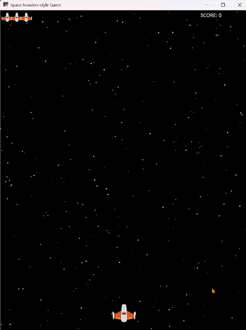

# Megamania

A 2D space shooter based on Activision's [Megamania](https://en.wikipedia.org/wiki/Megamania) game from 1982. It is written with Python and the Arcade 3.0 library, and uses [Rye for package management](https://rye.astral.sh/). Definitely still in progress, but it works now.

This game itself has been made entirely using Anthropic's AI, [Claude 3 Sonnet](https://claude.ai), with prompt engineering supplied by me. [Details here](https://bcorfman.github.io/post/exploratory_software-_devt/).

Tested on Windows 11.

First, install Rye. Then at a command prompt in the project directory, type `rye sync`. Finally, type `rye run python megamania.py`.

The prototype in action:

